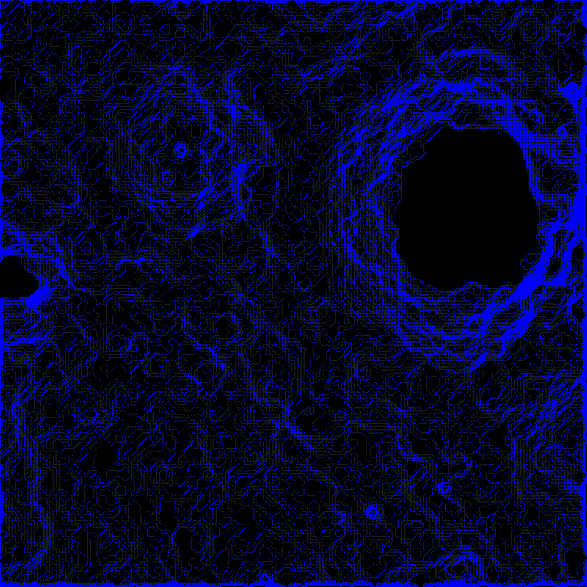
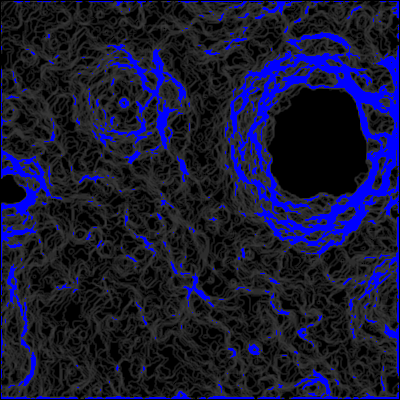
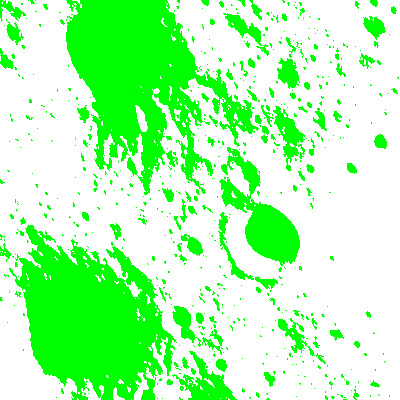
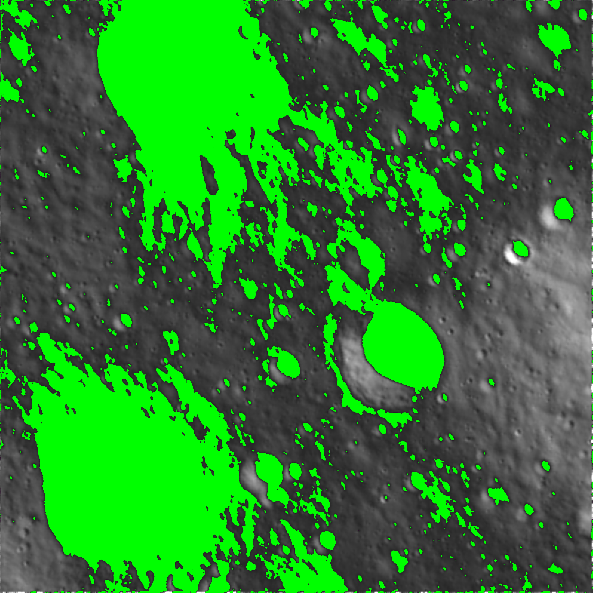
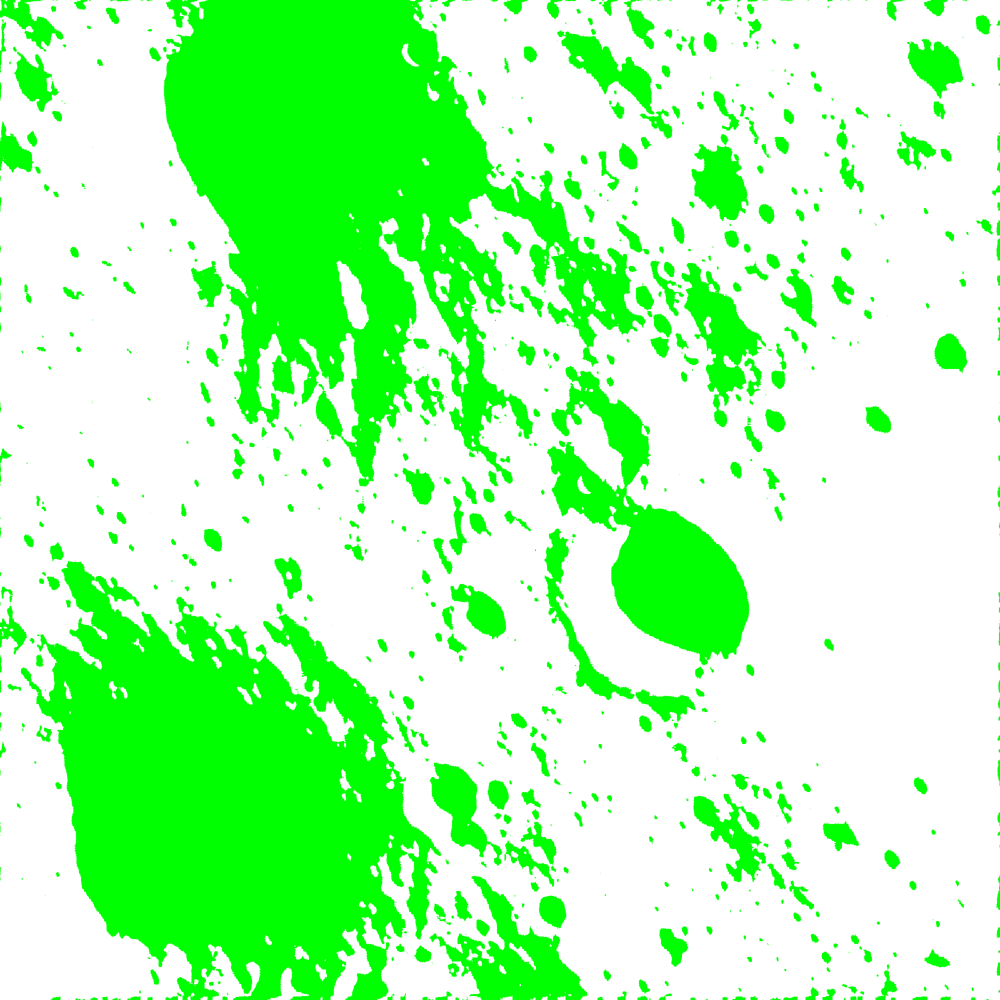

# Lunar Navigation

## Screenshots
### Slope

### Crater

### Shadow

### Hazard

### Combined

## Abstract

Lunar Navigation is a critical component for the success of lunar missions, requiring a comprehensive approach that integrates advanced techniques. This multifaceted system aims to ensure safe lunar navigation through the generation of high-resolution hazard maps, employing super-resolution methods, crater detection, crater pattern matching, and visual terrain relative navigation.

### Super-Resolution with Keras and GANs

- Utilizes Keras and Generative Adversarial Networks (GANs) to enhance low-resolution images from terrain mapping cameras.
- Provides a clearer, more detailed view of the lunar surface.
- Contributes to enhanced navigation accuracy by improving image resolution.

### Crater Detection with Ellipse R-CNN

- Employs the Ellipse R-CNN model for crater detection.
- Combines object retrieval and occlusion pattern recognition for precise hazard identification.
- Enhances the safety of lunar navigation by identifying potential hazards on the lunar surface.

### Crater Pattern Matching

- Focuses on recognizing recurring patterns in the lunar terrain.
- Refines hazard prediction by identifying consistent features.
- Provides valuable insights for mission planning and navigation safety.

### Visual Terrain Relative Navigation

- Involves identifying lunar surface features using visual data.
- Classifies terrain using DenseNet, estimating depth with Pix2Pix and GANs.
- Enhances navigation precision through deep learning techniques for terrain analysis and depth estimation.

### Challenges and Considerations

- Training feature-based transforms poses challenges in adapting to lunar surface variations.
- Accommodating varying lunar lighting conditions for accurate image analysis.
- Ensuring regular updates in the dynamic lunar environment for real-time navigation.
- Enhancing image resolution from terrain relative cameras to improve feature recognition.

### System Components

- Relies on deep learning models for various navigation tasks.
- Requires substantial computational resources for processing large datasets.
- Utilizes fine-tuned generative models to enhance image resolution.
- Incorporates advanced image processing techniques for accurate terrain analysis.

### Significance

- Integral for achieving safe lunar landings and ensuring the success of lunar exploration missions.
- Advances scientific endeavors by providing valuable data on the lunar environment.
- Demonstrates the capability of deep learning in addressing complex challenges in space exploration.
